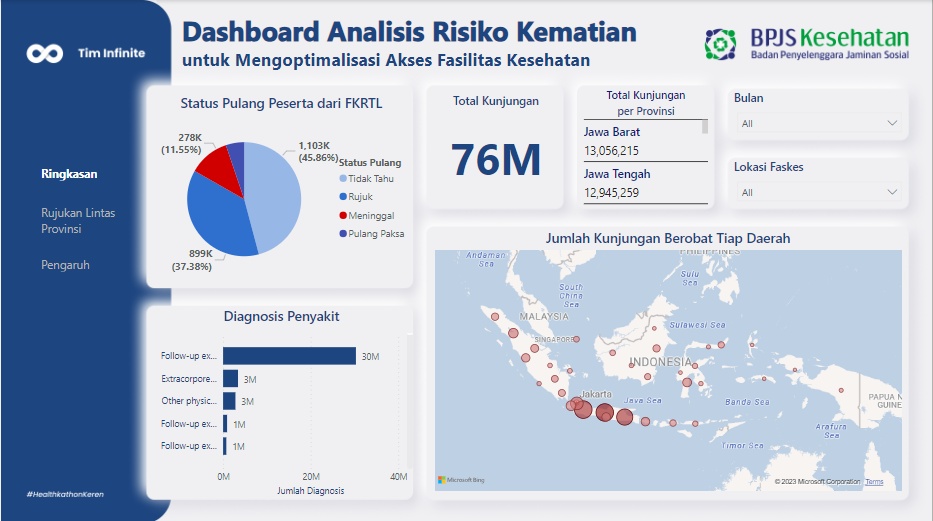
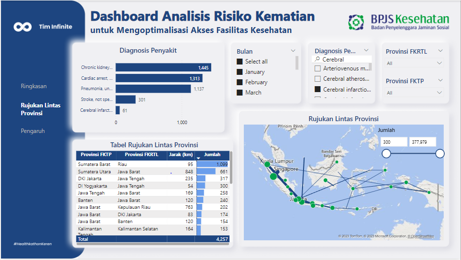
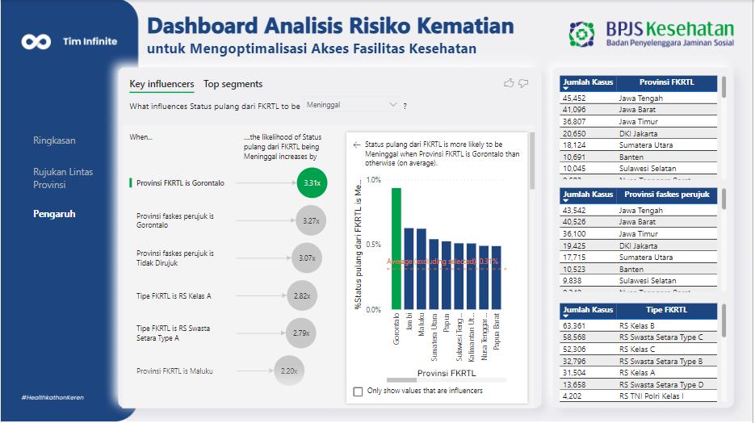

# Mortality-Risk-Analysis-Dashboard

## Dashboard

## Description
The death rate in Indonesia is projected to continue to increase since 2015. One way that can be done to reduce the death rate is to analyze the causes of death using data provided by BPJS. Several things that can be used as assumptions regarding factors causing death include: inadequate health facilities, disease diagnosis, and the profile of JKN-KIS participants.

The first suspected cause of death is inadequate health facilities in some areas. Inadequate facilities can be characterized by the location of referral health facilities that are different from the first-level health facility and/or city of residence. Some referral health facilities are located in different provinces. The difference in provinces indicates a considerable distance. Although the patient's condition at the time of referral may not be severe or critical, it is possible that the condition will become more severe within a certain time as the patient attempts to reach the referral health facility. 

The second assumed cause of death factor is disease diagnosis. Disease diagnoses that need to be considered are disease diagnoses that have a high chance of causing death. This can be obtained by finding the proportion of the relationship between each disease diagnosis and the return status of the participant.

The third assumed cause of death factor is the health-related profile of JKN-KIS participants. Examples of this profile data are BMI (body mass index) values, age and gender, and residence factors. BMI can be obtained by calculating the height and weight data of each participant. Age and gender have a higher risk of developing certain diseases. In addition, environmental factors such as an unhealthy place to live can be identified through city/district variables.

The designed dashboard will present a complete analysis of the possible factors above so that it can facilitate stakeholders in making the right decisions to reduce the mortality rate in Indonesia. The dashboard design uses Microsoft Power BI. The use of this software is due to its complete features, ease of access, practicality of use, and also its ability to show real-time data.

The referral page displays the distribution of referral health facility locations that are not in the same location as the first-level health facility location through a map display with arrows pointing to the referral health facility location.  

## Background of the Problem

According to predictions from the United Nations Population Fund (UNFPA) Indonesia, by 2019, Indonesia's population will reach 266.9 million people with details of 134 million men and 132.8 million women. In addition, the estimated number of deaths in 2019 reached 1.6 million people and will continue to increase to reach 3.2 million people in 2045. With population mortality on the rise, it is important to understand the impact on health services and mortality risks. Analysis of health facility locations and JKN-KIS membership profiles will show the availability of services and the extent of community access to health services, especially in cases of diseases that require referrals and more complicated diagnoses. This study is expected to provide in-depth insight into the factors that influence mortality risk and quality of health services in Indonesia. Thus, it can provide a basis for better policy decision-making in improving health systems and services.

## Objective
To minimize the risk of death by analyzing the location of health facilities in cases of illness that require referral, disease diagnosis, and JKN-KIS membership profile. 
